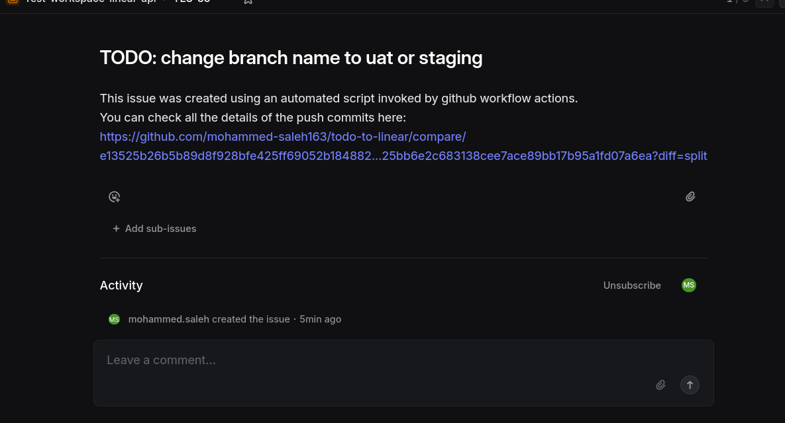
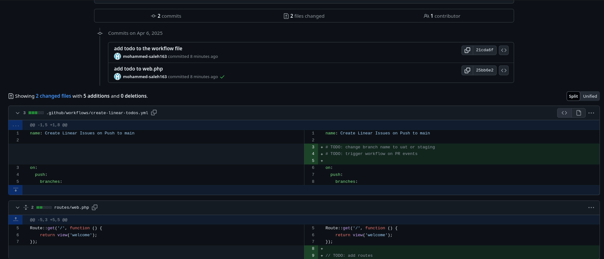

# NOTES

Before using the script you need:

1. Generate a Personal API Key in Linear and add it to the Repo's secrets to be used as an auth token. The secret's key must be "LINEAR_API_KEY"
2. Go to the dedicated team and copy the team's UUID by hitting cmd+k, write 'uuid' in the search box and copy it. Add the team's id to the repo's secrets under the key "TEAM_ID"

## How to use?

just write a comment with the prefix 'TODO:' and push to main...

## what's next?

This not a final implementation. But I'm triggering the workflow on push events because there are some fixes and patches that are pushed directly to some branches (like the Storefront's uat). It can be anything really, edit as you like.

Also, currently the issue's description includes the full details of the push that triggered the event. So, when writing todos, try to be more informative, and Github will take care of the rest.

## examples:

and the URL in the description leads us to:

Finally: it's not much, but it's honest work.

### _TL;DR: I'll be waiting for my 30 monsters if everything goes well 💰_
