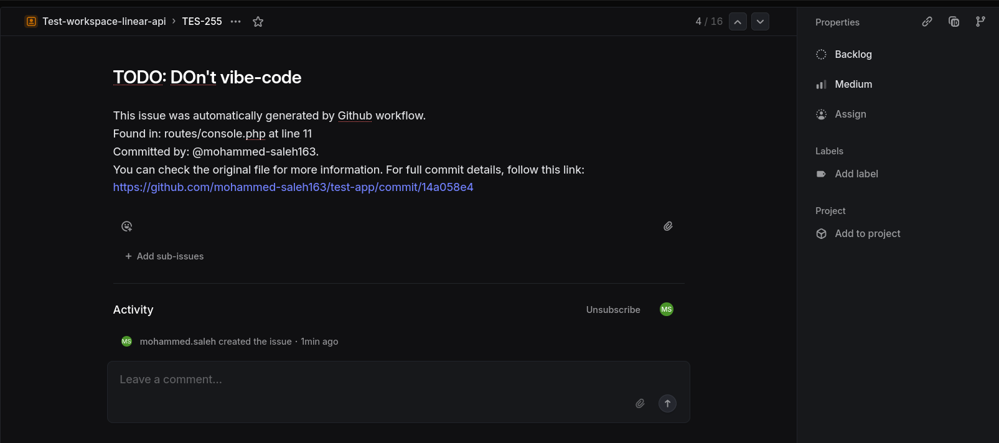

# NOTES

Before using the script you need:

1. Generate a Personal API Key in Linear and add it to the Repo's secrets to be used as an auth token. The secret's key must be "LINEAR_API_KEY"
2. Go to the dedicated team and copy the team's UUID by hitting cmd+k, write 'uuid' in the search box and copy it. Add the team's id to the repo's secrets under the key "TEAM_ID"

## How to use?

just write a comment with the prefix 'TODO:' and push to main...

## what's next?

This not a final implementation. But I'm triggering the workflow on push events because there are some fixes and patches that are pushed directly to some branches (like the Storefront's uat). It can be anything really, edit as you like.

Also, currently the issue's description includes the full details of the push that triggered the event. So, when writing todos, try to be more informative, and Github will take care of the rest.

## examples:

and the URL in the description leads us to:

Finally: it's not much, but it's honest work.

### _TL;DR: I'll be waiting for my 30 monsters if everything goes well 💰_

# Updates 🔨:

As requested by @Charlo, I added a new script as part of the CI workflow that:

-   Scans all git tracked files for any TODOs, FIXMEs, or BUGs
-   Creates Linear issues with a medium priority for TODOs and high for FIXMEs and BUGs
-   Describes the issues with more details such as file location, line number, and the commit URL

### Example:

Also, this operation is _idempotent_, meaning that no issue can be duplicated once it has been created.

One thing to note is that all the issues are created as backlog and with no label. But this can easily change..

Clone this repo and test it, or simply copy the scripts in any repo and have fun with it.
